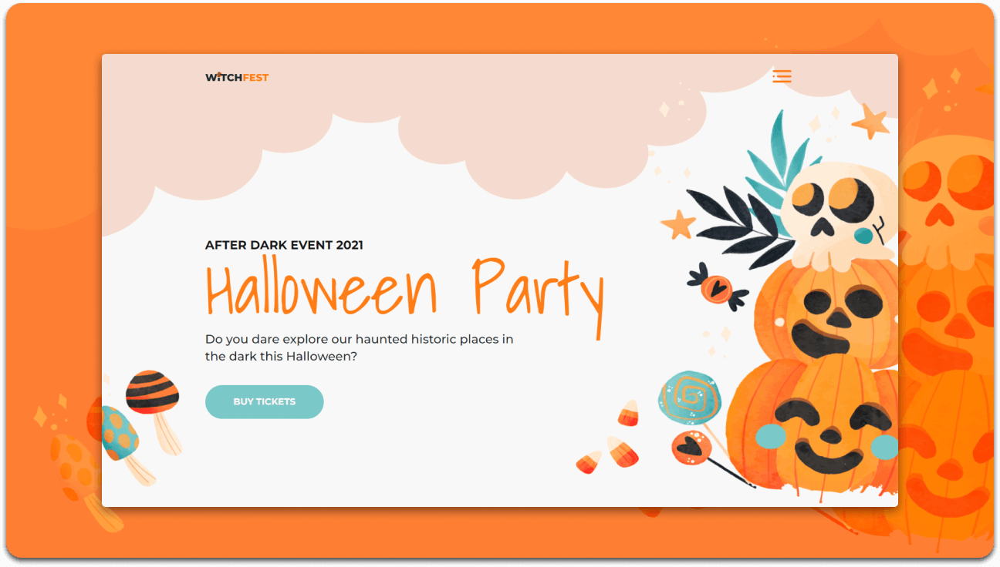

 

<!-- 🔰 BADGES -->

 

<!-- 🔰 PROJECT LOGO -->

 
 

<h1 align="center">🎃 Halloween Landing Page</h1>

A creative, spooky, and fully responsive **Halloween-themed landing page**  
built using **HTML and CSS**.

<a href="https://halloween-landing-page-seven.vercel.app/"><strong>➥ Live Demo</strong></a>

---

<!-- TABLE OF CONTENTS -->

  
📑 Table of Contents

  <ol>
    <li><a href="#about-the-project">About The Project</a></li>
    <li><a href="#features">Features</a></li>
    <li><a href="#built-with">Built With</a></li>
    <li><a href="#contact">Contact</a></li>
  </ol>

---

## 📖 About The Project

The **Halloween Landing Page** is a creative and responsive seasonal web interface designed to capture the spooky atmosphere of Halloween through engaging visuals, dark aesthetics, and a festive layout.

The layout focuses on:

- 🎃 Halloween-inspired visual design
- 👻 Dark and spooky aesthetic
- 🕸️ Creative seasonal content presentation
- 📱 Fully responsive layouts for different screen sizes
- 🎨 Eye-catching typography, spacing, and visual elements

This project demonstrates the ability to create **themed landing pages**, build visually engaging layouts, and deliver responsive interfaces with a polished user experience.

Ideal for:

- 🎃 Halloween events and celebrations
- 🛍️ Seasonal eCommerce promotions
- 📢 Festive marketing campaigns
- 🎨 Creative landing page concepts
- 💻 Front-end UI and responsive design practice

(<a href="#top">back to top</a>)

---

## ✨ Features

- Fully responsive Halloween-themed layout
- Creative and spooky visual design
- Dark and festive color scheme
- Clean and structured page sections
- Engaging seasonal visuals
- Mobile-friendly design
- Smooth and polished user experience
- Easy to customize for events and campaigns

(<a href="#top">back to top</a>)

---

## 🛠️ Built With

This project is built using:

- **HTML5**
- **CSS3**

(<a href="#top">back to top</a>)

---

## 📬 Contact

**Muhammad Salman Arshad**

- 💼 **LinkedIn:** https://www.linkedin.com/in/muhammad-salmanarshad/
- 🎨 **Figma:** https://www.figma.com/@codewithsalman
- 📧 **Email:** [msalmanwebdev@gmail.com](mailto:msalmanwebdev@gmail.com)

(<a href="#top">back to top</a>)

