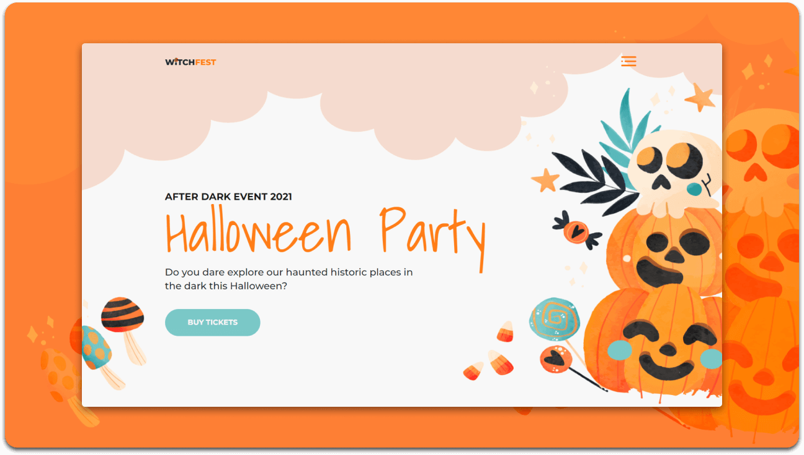

 

# 🎃 Halloween Landing Page

<!-- TABLE OF CONTENTS -->

  
Table of Contents

  <ol>
    <li><a href="#about-the-project">About The Project</a></li>
    <li><a href="#built-with">Built With</a></li>
    <li><a href="#contact">Contact</a></li>
  </ol>

---

## About The Project

  

The **Halloween Landing Page** is a spooky-themed, creative, and responsive web design built using HTML and CSS.  
It is designed to capture the **Halloween spirit** while serving as a festive landing page for events, product promotions, or campaigns.  

### Key Features:
- 🕸️ Dark and spooky aesthetic with Halloween vibes.  
- 👻 Clean and responsive layout for all devices.  
- 🕯️ Perfect for **event promotions, e-commerce Halloween sales, or themed campaigns**.  
- 🎨 Eye-catching visuals that create a festive mood.  

This project can serve as a **fun web template** for Halloween events or seasonal marketing pages.

---

## Built With

This project was created using:

* [HTML5](https://html5.org/)  
* [CSS3](https://css3.com/)

---

## Contact

LinkedIn - [Muhammad Salman Arshad](https://www.linkedin.com/in/muhammad-salmanarshad/)  
Email - [msalmanwebdev@gmail.com](mailto:msalmanwebdev@gmail.com)

(<a href="#top">back to top</a>)

